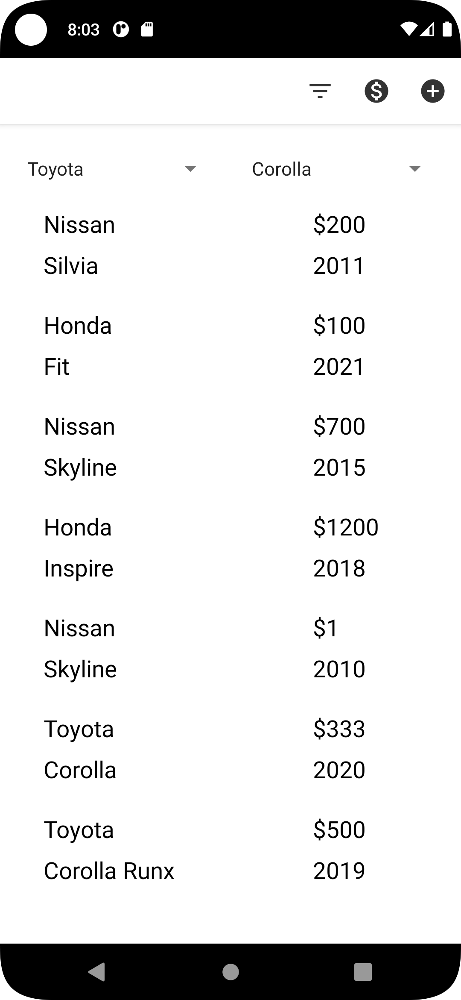
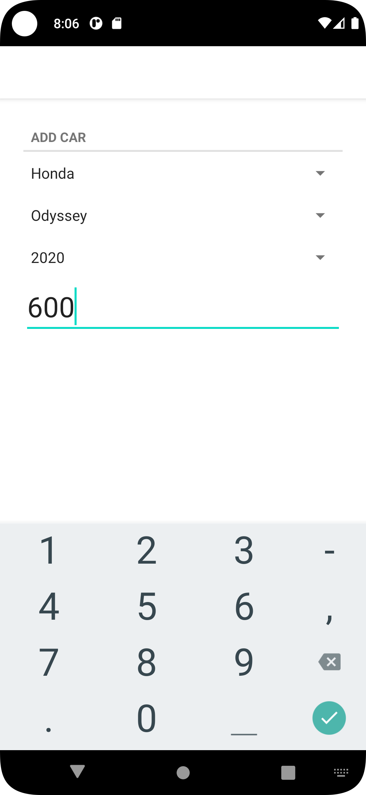
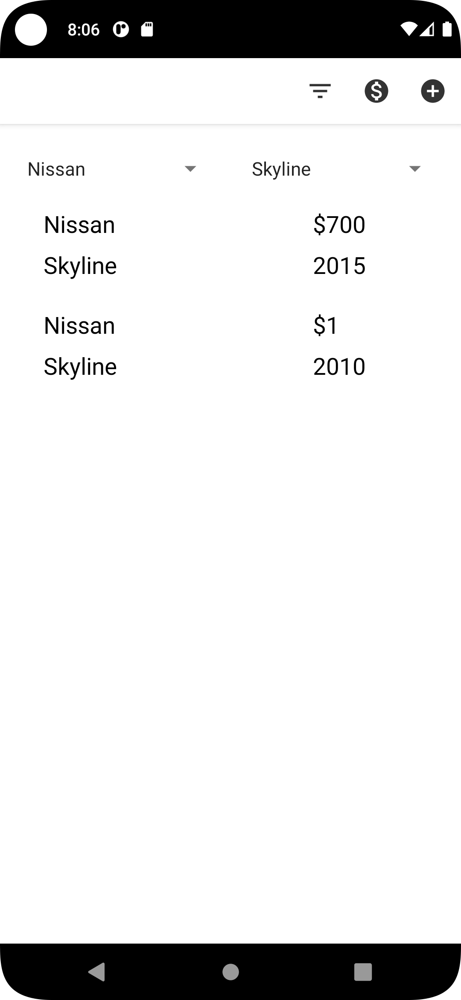
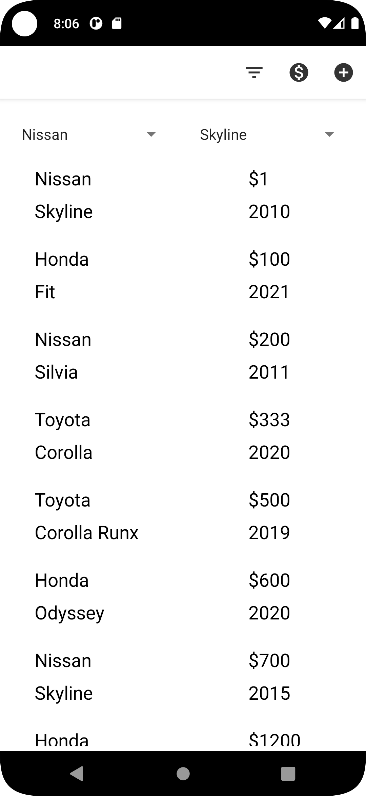

<p align = "center">МИНИСТЕРСТВО НАУКИ И ВЫСШЕГО ОБРАЗОВАНИЯ<br>
РОССИЙСКОЙ ФЕДЕРАЦИИ<br>
ФЕДЕРАЛЬНОЕ ГОСУДАРСТВЕННОЕ БЮДЖЕТНОЕ<br>
ОБРАЗОВАТЕЛЬНОЕ УЧРЕЖДЕНИЕ ВЫСШЕГО ОБРАЗОВАНИЯ<br>
«САХАЛИНСКИЙ ГОСУДАРСТВЕННЫЙ УНИВЕРСИТЕТ»</p>
<br><br><br><br><br><br>
<p align = "center">Институт естественных наук и техносферной безопасности<br>Кафедра информатики<br>Григораш Алексей Владимирович</p>
<br><br><br>
<p align = "center"><br><strong>«Приложение. Авто»</strong><br>01.03.02 Прикладная математика и информатика</p>
<br><br><br><br><br><br><br><br><br><br><br><br>
<p align = "right">Научный руководитель<br>
Соболев Евгений Игоревич</p>
<br><br><br>
<p align = "center">г. Южно-Сахалинск<br>2023 г.</p>
<br><br><br><br><br><br><br><br>

## Введение:
**Android Studio** — интегрированная среда разработки производства Google, с помощью которой разработчикам становятся доступны инструменты для создания приложений на платформе Android OS


## Задачи:


Приложение, должно иметь следующие функции:

- Отображение списка автомобилей с характеристиками (10-12 автомобилей, 3 производителя, 1-3 марки у каждого производителя)
- Добавление нового автомобиля
- Редактирование деталей автомобиля

Желательно:
- Фильтрация по производителю и марке
- Сортировка по цене


## Решение:

<div align="center">
    
    
    
    
</div>

### CarFragment.kt
```kt
package com.example.cars

import android.os.Bundle
import android.view.LayoutInflater
import android.view.View
import android.view.ViewGroup
import android.widget.AdapterView
import android.widget.ArrayAdapter
import android.widget.EditText
import android.widget.Spinner
import androidx.core.text.isDigitsOnly
import androidx.core.widget.doAfterTextChanged
import androidx.fragment.app.Fragment
import androidx.lifecycle.ViewModelProviders
import java.util.*
import androidx.lifecycle.Observer


private const val TAG = "CarFragment"
private const val ARG_CAR_ID = "car_id"

class CarFragment : Fragment() {

    var years = listOf("2010", "2011", "2012", "2013", "2014", "2015", "2016", "2017", "2018", "2019", "2020", "2021", "2022", "2023")
    var marks = listOf("Toyota", "Nissan", "Honda")
    var toyota = listOf("Corolla", "Corolla Alex", "Corolla Axio", "Corolla Runx", "Corolla Fielder")
    var nissan = listOf("Skyline", "Silvia", "Serena", "Sentra", "Sunny")
    var honda = listOf("Civic", "Fit", "Accord", "Inspire", "Odyssey")

    private lateinit var car : Car
    private lateinit var yearSpinner: Spinner
    private lateinit var markSpinner: Spinner
    private lateinit var modelSpinner: Spinner
    private lateinit var priceEditText: EditText
    private lateinit var markAdapter: ArrayAdapter<String>
    private lateinit var modelAdapter: ArrayAdapter<String>
    private lateinit var yearAdapter: ArrayAdapter<String>


    private val carDetailViewModel: CarDetailViewModel by lazy {
        ViewModelProviders.of(this).get(CarDetailViewModel::class.java)
    }

    override fun onCreate(savedInstanceState: Bundle?) {
        super.onCreate(savedInstanceState)
        car = Car()
        val carId: UUID = arguments?.getSerializable(ARG_CAR_ID) as UUID
        carDetailViewModel.loadCar(carId)
    }


    override fun onCreateView(
        inflater: LayoutInflater,
        container: ViewGroup?,
        savedInstanceState: Bundle?
    ): View? {
        val view = inflater.inflate(R.layout.fragment_car, container, false)


        markSpinner = view.findViewById(R.id.car_mark)
        modelSpinner = view.findViewById(R.id.car_model)
        yearSpinner = view.findViewById(R.id.car_year)
        priceEditText = view.findViewById(R.id.car_price)

        markAdapter = ArrayAdapter(requireContext(), android.R.layout.simple_spinner_item, marks)
        markAdapter.setDropDownViewResource(android.R.layout.simple_spinner_dropdown_item);
        markSpinner.setAdapter(markAdapter);

        modelAdapter = ArrayAdapter(requireContext(), android.R.layout.simple_spinner_item, toyota)
        modelAdapter.setDropDownViewResource(android.R.layout.simple_spinner_dropdown_item);
        modelSpinner.setAdapter(modelAdapter);

        yearAdapter = ArrayAdapter(requireContext(), android.R.layout.simple_spinner_item, years)
        yearAdapter.setDropDownViewResource(android.R.layout.simple_spinner_dropdown_item);
        yearSpinner.setAdapter(yearAdapter);

        return view
    }

    override fun onViewCreated(view: View, savedInstanceState: Bundle?) {
        super.onViewCreated(view, savedInstanceState)
        carDetailViewModel.carLiveData.observe(
            viewLifecycleOwner,
            Observer { car ->
                car?.let {
                    this.car = car
                    updateUI()
                }
            })
    }

    override fun onStart() {
        super.onStart()

        markSpinner.onItemSelectedListener = object : AdapterView.OnItemSelectedListener {
            override fun onItemSelected(parent: AdapterView<*>?, view: View?, position: Int, id: Long) {

                car.mark = markSpinner.selectedItem as String

                when(car.mark){
                    "Nissan" -> modelAdapter = ArrayAdapter(requireContext(), android.R.layout.simple_spinner_item, nissan)
                    "Toyota" -> modelAdapter = ArrayAdapter(requireContext(), android.R.layout.simple_spinner_item, toyota)
                    "Honda" ->  modelAdapter = ArrayAdapter(requireContext(), android.R.layout.simple_spinner_item, honda)
                }

                modelAdapter.setDropDownViewResource(android.R.layout.simple_spinner_dropdown_item);
                modelSpinner.setAdapter(modelAdapter);
            }

            override fun onNothingSelected(parent: AdapterView<*>?) {
            }
        }

        modelSpinner.onItemSelectedListener = object : AdapterView.OnItemSelectedListener {
            override fun onItemSelected(parent: AdapterView<*>?, view: View?, position: Int, id: Long) {
                car.model = modelSpinner.selectedItem as String
            }

            override fun onNothingSelected(parent: AdapterView<*>?) {

            }
        }

        yearSpinner.onItemSelectedListener = object : AdapterView.OnItemSelectedListener {
            override fun onItemSelected(parent: AdapterView<*>?, view: View?, position: Int, id: Long) {
                car.year = yearSpinner.selectedItem.toString().toInt()
            }

            override fun onNothingSelected(parent: AdapterView<*>?) {

            }
        }


        priceEditText.doAfterTextChanged {
            car.price = if (it.isNullOrEmpty()) 0
            else it.toString().toInt()
        }

    }

    override fun onStop() {
        super.onStop()
        carDetailViewModel.saveCar(car)
    }

    private fun updateUI() {
        var position = markAdapter.getPosition(car.mark)
        markSpinner.setSelection(position);
        position = modelAdapter.getPosition(car.model)
        modelSpinner.setSelection(position);
        position = yearAdapter.getPosition(car.year.toString())
        yearSpinner.setSelection(position);
        priceEditText.setText(car.price.toString())

    }

    companion object {
        fun newInstance(autoId: UUID): CarFragment {
            val args = Bundle().apply {
                putSerializable(ARG_CAR_ID, autoId)
            }
            return CarFragment().apply {
                arguments = args
            }
        }
    }
}
```


### CarListFragment.kt
```kt
package com.example.cars

import android.annotation.SuppressLint
import android.content.Context
import android.os.Bundle
import android.view.*
import android.widget.AdapterView
import android.widget.ArrayAdapter
import android.widget.Spinner
import android.widget.TextView
import androidx.fragment.app.Fragment
import androidx.lifecycle.Observer
import androidx.lifecycle.ViewModelProvider
import androidx.lifecycle.ViewModelProviders
import androidx.recyclerview.widget.LinearLayoutManager
import androidx.recyclerview.widget.RecyclerView
import java.util.*
import com.example.cars.*


private const val TAG = "CarListFragment"

class CarListFragment : Fragment() {

    interface Callbacks {
        fun onCarSelected(carId: UUID)
    }

    private lateinit var markAdapter: ArrayAdapter<String>
    private lateinit var modelAdapter: ArrayAdapter<String>
    private lateinit var markFilter: Spinner
    private lateinit var modelFilter: Spinner


    private var callbacks: Callbacks? = null
    private lateinit var carRecyclerView: RecyclerView
    private var adapter: CarAdapter? = CarAdapter(emptyList())

    private val carListViewModel: CarListViewModel by lazy {
        ViewModelProviders.of(this).get(CarListViewModel::class.java)
    }


    override fun onAttach(context: Context) {
        super.onAttach(context)
        callbacks = context as Callbacks?
    }

    override fun onCreate(savedInstanceState: Bundle?) {
        super.onCreate(savedInstanceState)
        setHasOptionsMenu(true)
    }

    @SuppressLint("MissingInflatedId")
    override fun onCreateView(
        inflater: LayoutInflater,
        container: ViewGroup?,
        savedInstanceState: Bundle?
    ): View? {
        val view = inflater.inflate(R.layout.fragment_car_list, container, false)

        carRecyclerView =
            view.findViewById(R.id.car_recycler_view) as RecyclerView
        carRecyclerView.layoutManager = LinearLayoutManager(context)
        carRecyclerView.adapter = adapter

        val marks = listOf("Toyota", "Nissan", "Honda")
        val toyota = listOf("Corolla", "Corolla Alex", "Corolla Axio", "Corolla Runx", "Corolla Fielder")
        val nissan = listOf("Skyline", "Silvia", "Serena", "Sentra", "Sunny")
        val honda = listOf("Civic", "Fit", "Accord", "Inspire", "Odyssey")

        markFilter = view.findViewById(R.id.mark_filter)
        modelFilter = view.findViewById(R.id.model_filter)


        markAdapter = ArrayAdapter(requireContext(), android.R.layout.simple_spinner_item, marks)
        markAdapter.setDropDownViewResource(android.R.layout.simple_spinner_dropdown_item)
        markFilter.setAdapter(markAdapter)

        markFilter.onItemSelectedListener = object : AdapterView.OnItemSelectedListener {
            override fun onItemSelected(parent: AdapterView<*>?, view: View?, position: Int, id: Long) {


                when(markFilter.selectedItem as String){
                    "Nissan" -> modelAdapter = ArrayAdapter(requireContext(), android.R.layout.simple_spinner_item, nissan)
                    "Toyota" -> modelAdapter = ArrayAdapter(requireContext(), android.R.layout.simple_spinner_item, toyota)
                    "Honda" ->  modelAdapter = ArrayAdapter(requireContext(), android.R.layout.simple_spinner_item, honda)
                }

                modelAdapter.setDropDownViewResource(android.R.layout.simple_spinner_dropdown_item);
                modelFilter.setAdapter(modelAdapter);
            }

            override fun onNothingSelected(parent: AdapterView<*>?) {
            }
        }
        return view
    }

    override fun onViewCreated(view: View, savedInstanceState: Bundle?) {
        super.onViewCreated(view, savedInstanceState)
        carListViewModel.carListLiveData.observe(
            viewLifecycleOwner,
            Observer { cars ->
                cars?.let {
                    updateUI(cars)
                }
            })
    }

    override fun onDetach() {
        super.onDetach()
        callbacks = null
    }

    override fun onCreateOptionsMenu(menu: Menu, inflater: MenuInflater) {
        super.onCreateOptionsMenu(menu, inflater)
        inflater.inflate(R.menu.fragment_car_list, menu)
    }

    override fun onOptionsItemSelected(item: MenuItem): Boolean {
        return when (item.itemId) {
            R.id.new_car -> {
                val car = Car()
                carListViewModel.addCar(car)
                callbacks?.onCarSelected(car.id)
                true
            }
            R.id.price_sort ->{
                carListViewModel.carListLiveData.observe(
                    viewLifecycleOwner,
                    Observer { cars ->
                        cars?.let {
                            val sorted = cars.sortedBy { it.price }
                            updateUI(sorted)
                        }
                    })
                true
            }
            R.id.filter -> {
                carListViewModel.carListLiveData.observe(
                    viewLifecycleOwner,
                    Observer { cars ->
                        cars?.let {
                            val sorted = ArrayList<Car>()
                            cars.forEach {
                                val mark = markFilter.selectedItem.toString()
                                val model = modelFilter.selectedItem.toString()
                                if(it.model == model && it.mark == mark)
                                    sorted.add(it)
                            }
                            updateUI(sorted)
                        }
                    })
                true
            }
            else -> return super.onOptionsItemSelected(item)
        }

    }

    companion object {
        fun newInstance(): CarListFragment {
            return CarListFragment()
        }
    }

    private fun updateUI(cars: List<Car>) {

        adapter = CarAdapter(cars)
        carRecyclerView.adapter = adapter

    }

    private inner class AutoHolder(view: View)
        : RecyclerView.ViewHolder(view), View.OnClickListener {

        private lateinit var car: Car

        private val markTextView: TextView = itemView.findViewById(R.id.car_mark)
        private val modelTextView: TextView = itemView.findViewById(R.id.car_model)
        private val priceTextView: TextView = itemView.findViewById(R.id.car_price)
        private val yearTextView: TextView = itemView.findViewById(R.id.car_year)

        init {
            itemView.setOnClickListener(this)
        }

        @SuppressLint("SetTextI18n")
        fun bind(car: Car) {
            this.car = car
            markTextView.text = this.car.mark
            modelTextView.text = this.car.model
            priceTextView.text = "$${this.car.price}"
            yearTextView.text = this.car.year.toString()

        }

        override fun onClick(v: View) {
            callbacks?.onCarSelected(car.id)
        }
    }

    private inner class CarAdapter(var cars: List<Car>)
        : RecyclerView.Adapter<AutoHolder>() {

        override fun onCreateViewHolder(parent: ViewGroup, viewType: Int): AutoHolder {

            val view = layoutInflater.inflate(R.layout.list_item_car, parent, false)
            return AutoHolder(view)
        }

        override fun onBindViewHolder(holder: AutoHolder, position: Int) {
            val car = cars[position]
            holder.bind(car)
        }


        override fun getItemCount() = cars.size
    }

}
```
